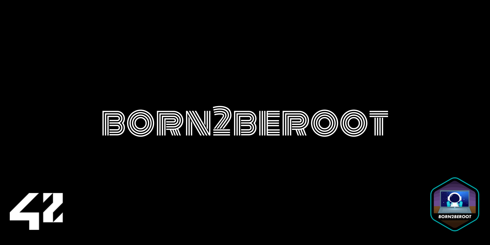
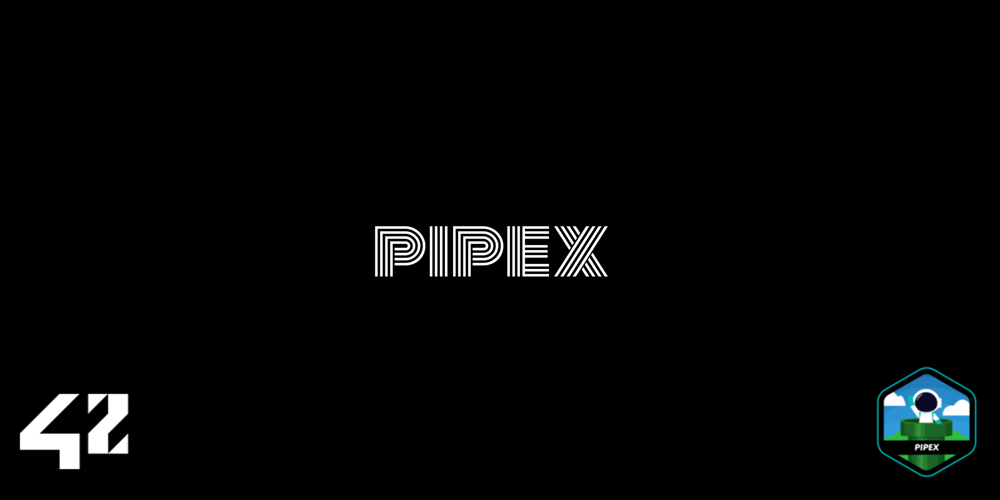
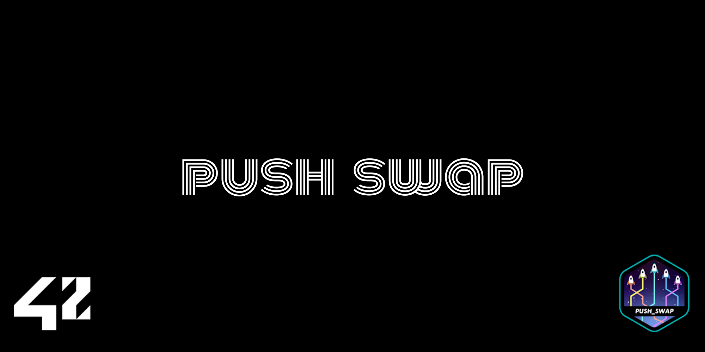

# Hello there, my name is Alex

## 🛹 About Me
🔧 Computer technician. 
📚 I'm a Student at the 42 Madrid campus.  
📖 Currently learning to code in C & C++.  
💬 Ask me about C!  

---

## 🛠️ Tools & Languages

---

## 42 Cursus
](https://profile.intra.42.fr/users/atabarea)

---

## 42 Project Badges
| Project name                                      |                    Badge                     |
| :-----------------------------------------------: | :------------------------------------------: |
|           |                 | 
| | |
|     |     |
|         |         |
|             |             |
|                 |                 |
|         |         |
|   |   |

---

## 📊 GitHub Stats

---

## 🌐 Connect With Me

